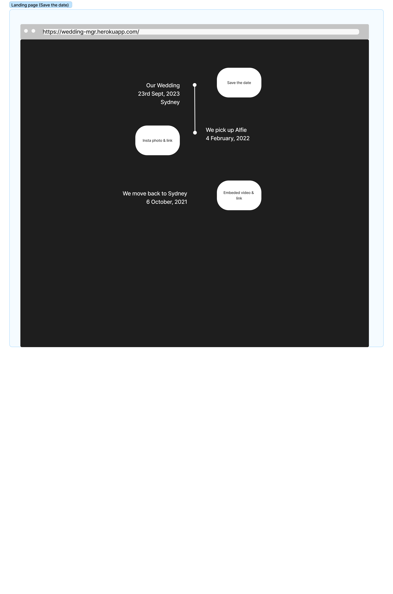
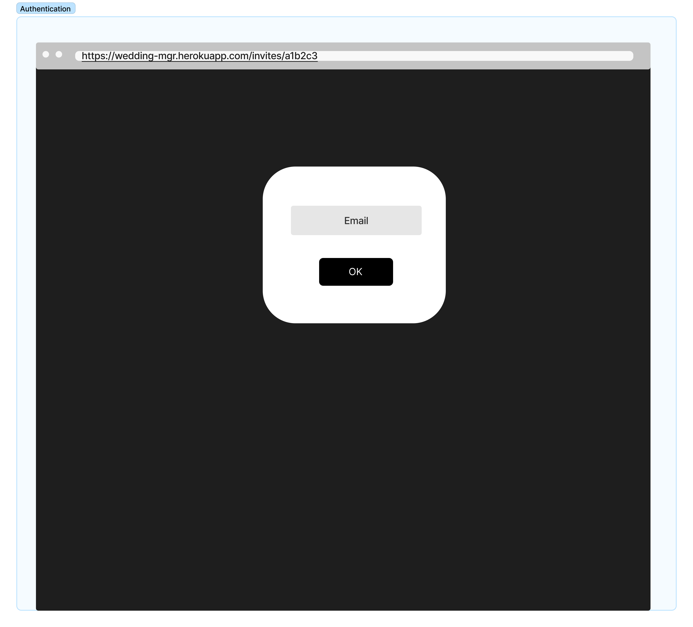
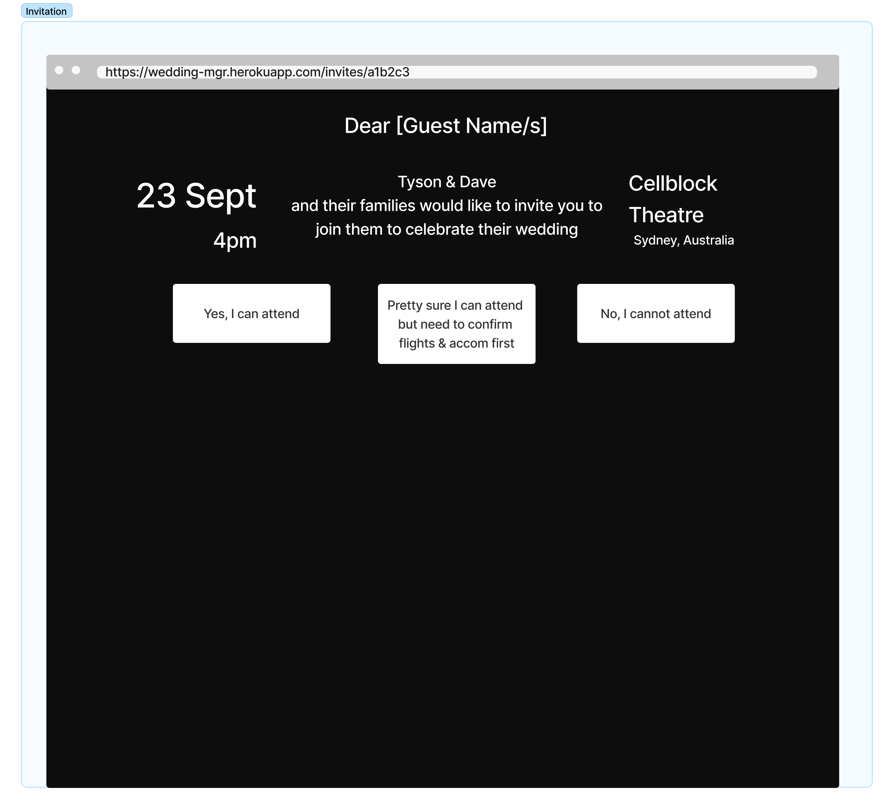
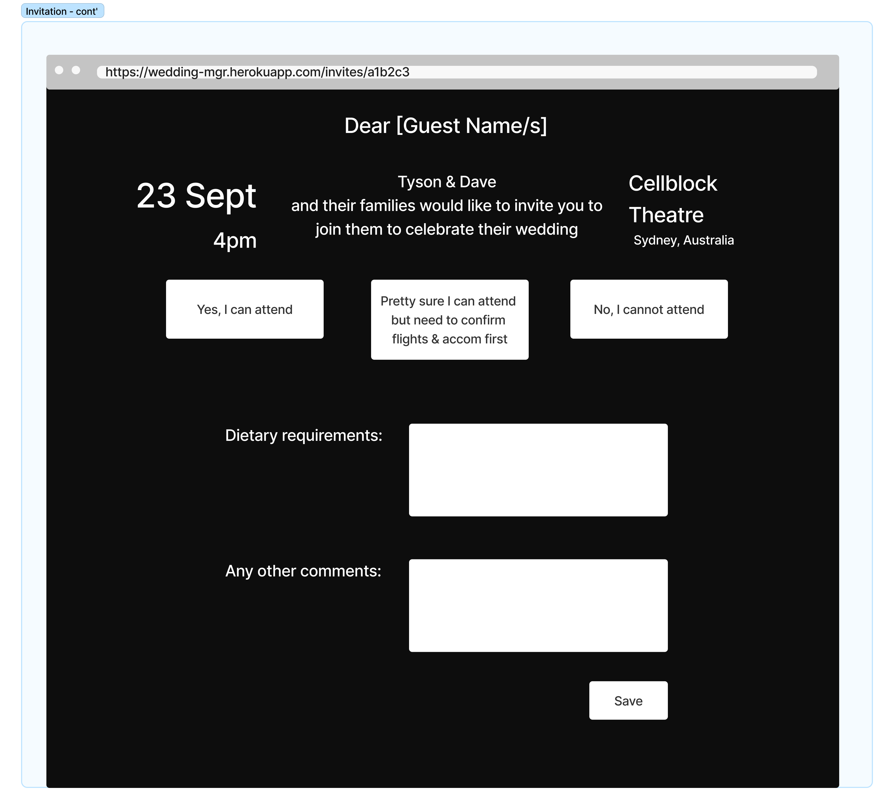
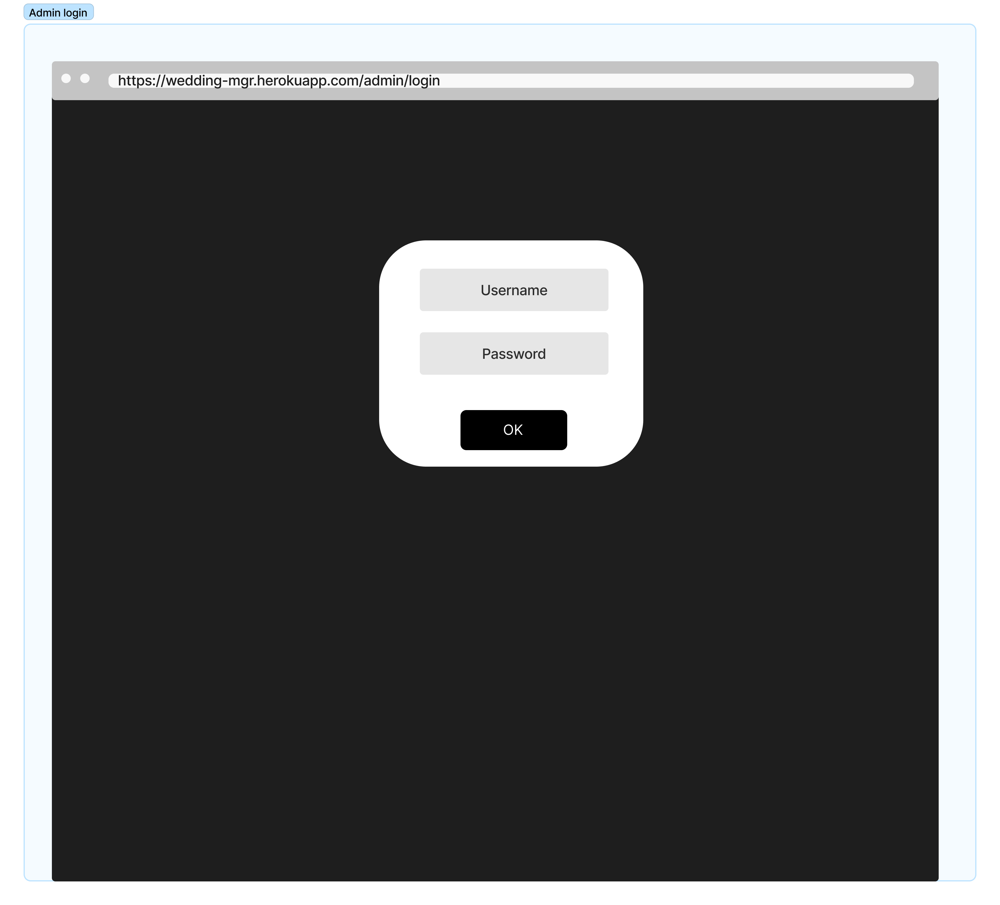
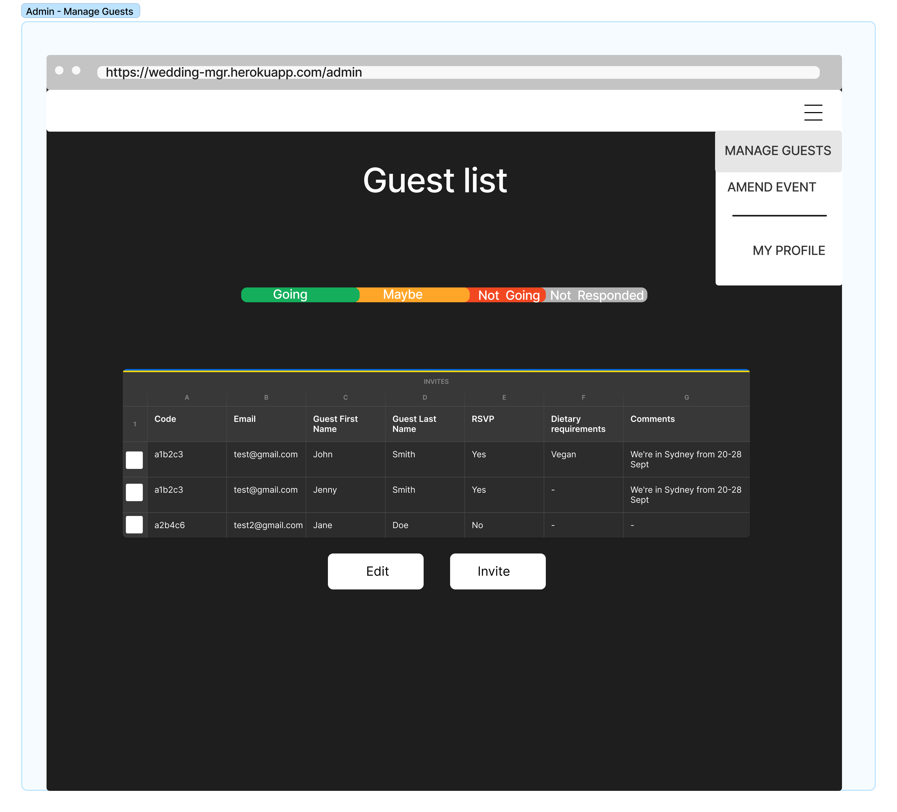
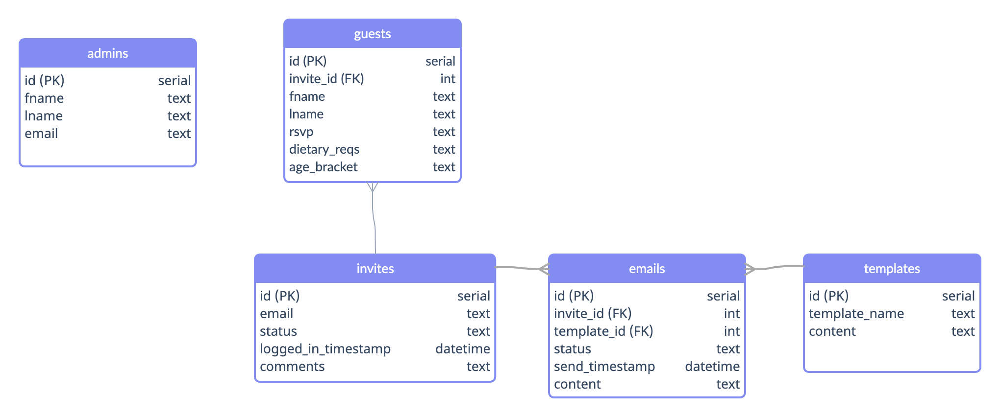
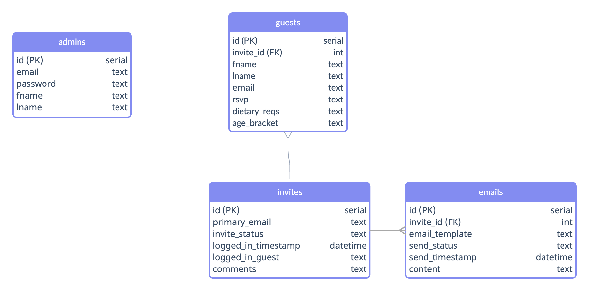

# A Wedding Manager

So, next year (2023), my partner and I are getting married. We've been engaged for about 4 years now, so it's been a long time coming. We're finally getting our act together and locking in a date. The topic of invites came up and I thought, with my newfound software engineering skills, I'd build our invites online. This webapp is the result of that thought.

## Login

To try out the app, go to [https://wedding-mgr.herokuapp.com/](https://wedding-mgr.herokuapp.com/) and use one of the below logins.

<u>Login as an admin:</u>

<li><strong>Email:</strong> user@gmail.com</li>
<li><strong>Password:</strong> test</li>

<u>Login as a guest:</u>
<li><strong>Email:</strong> guest1@gmail.com</li>

## Installation

To install, download all files, navigate to the root folder and type `yarn`. This will install all packages used by the backend.
Then navigate to the client folder (`cd client`) and type `yarn` again. This will install all the packages used by the frontend.
Then you can serve the backend by typing `yarn start` while in the root folder, and serve the frontend by typing `yarn start` while in the client folder.

## Technologies

### Backend

[Node.js](https://nodejs.org/en/) - used as the primary server environment

[Express.js](https://expressjs.com/) - a Node.js web application framework

[Twilio SendGrid](https://github.com/sendgrid/sendgrid-nodejs/tree/main/packages/mail) - used to send emails from the app

[bcrypt](https://github.com/kelektiv/node.bcrypt.js#readme) - used to hash the Admin passwords and the guest emails

[dotenv](https://github.com/motdotla/dotenv#readme) - used to load environment variables for the Twilio SendGrid API and Expression Secret Key

[express-session](https://github.com/expressjs/session#readme) - session middleware used in Express

[PostgreSQL](https://www.postgresql.org/) - the SQL database system used to store the guest and admin data

[node-postgres](https://node-postgres.com/) - a collection of node.js modules for interfacing with the PostgreSQL database

#### Backend Dev Dependancies

[nodemon](https://nodemon.io/) - automatically reloads the server environment upon detecting any new changes (when in development)

### Front End

[React](https://reactjs.org/) - a javascript library used to render components easily

[MUI Library](https://mui.com/material-ui/getting-started/overview/) - used to incorporate standardised React components that function well and look consistent.

[axios](https://axios-http.com/docs/intro) - used to make API calls to the backend

[react-router-dom](https://v5.reactrouter.com/web/guides/quick-start) - used to set up routes to different pages on the front end

#### Frontend Dev Dependancies

[react-testing-library](https://testing-library.com/docs/react-testing-library/intro/) - used to test react components

## Approach

### Project page

I began with a list of features that I thought would be interesting to build, essentially eliciting my own requirements. Those can be found on this Github Project page here: [https://github.com/users/davebdev/projects/5/views/1](https://github.com/users/davebdev/projects/5/views/1).

Then I started prioritising those features by categorising them into 'Must', 'Should', 'Could' and 'Won't'.

The main features I wanted to have was an admin portal that we as the grooms could login to to control the guest list, event details and other features. I then wanted to build a portal where my guests could use their own emails to login and see the details of the event as well as allow them to rsvp, submit dietary requirements etc.

### Wireframes

After that, I start to put together some basic wireframes on [Figma.com](https://figma.com/) as seen below:

#### Landing Page

#### Guest Authentication

#### Invitation (pt1)

#### Invitation (pt2)

#### Admin Authentication

#### Manage Guests

### DB Schema

After putting together some wireframes, I had an idea of what the database might look like, and sketched that out using [creately.com](https://creately.com/):

#### Version 1

This is what I first came up with:

#### Version 2

After setting up the email API, I realised that the concept of keeping templates in the database was not practical, nor would it serve the app, so I took that table out.

### Version 3

Well into the second week of building, I realised that the 'primary_email' field sitting on the invites table wasn't necessary, so I took that out.

## Unsolved problems

There are many features I didn't get a chance to work on or fully flesh out. The following points list some of the main features that I didn't have time to explore properly:

- I initially intended to use the Twilio SendGrid API to generate emails that could be sent out to all the guests. I got as far as setting up the initial API and getting the email sending to work, but ran out of time to incorporate that into the app in any meaningful way
- I wanted to create a section for the admins to upload their photos from the day so that guests can login later and view/download the official photos
- I toyed with the idea of putting some sort of section where the admins could list links to things they would like (sort of like a gift registry) and guests could 'claim' them
- I wanted to create a new table that stored comments that could be sent back and forth between the grooms and the guests, almost like a messenger type service
- There's a lot more I wanted to do with the css but incorporating the MUI components actually made it difficult to apply css consistently because there are various ways to apply css to various components and without having the time to explore those ways more fully, I had to use a lot of examples I found online which applied styles in different ways. Having an overall approach to css became difficult because of this.

## Testing

There are two main testing files:

- client/src/Admin.test.js: This file tests the login functionality of the admin login - including mocking axios calls to the backend
- client/src/App.test.js: This file tests the login functionality built for guests, also including mocking axios calls to the backend